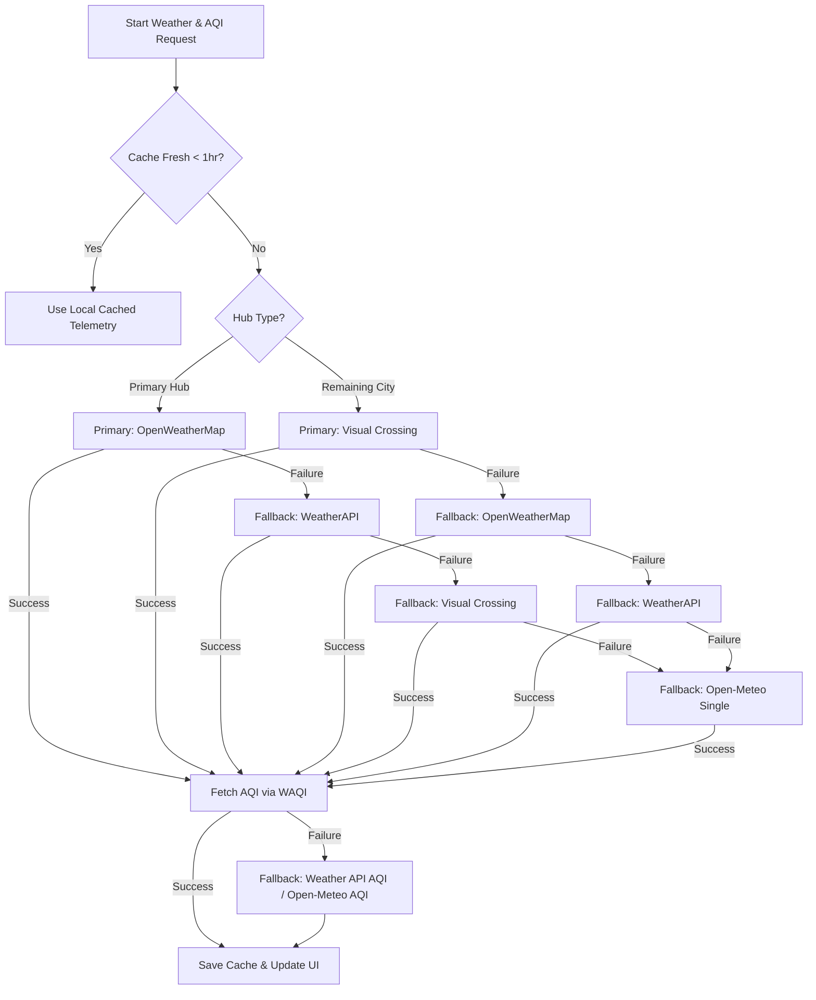

# SCM Dashboard Integration Reference

This document outlines the architecture for the multi-provider weather cascading pipeline, local caching, and live route traffic details integrated into the LogiControl Supply Chain Mission Control dashboard.

## 1. Weather Data Cascade Engine

To distribute API load and handle outages or rate limits, the dashboard implements a cascaded failover chain on a per-city basis:

### Local Caching Mechanism
* **Storage Location**: `localStorage` (persists across page refreshes).
* **Key**: `scm_weather_cache`.
* **Expiration**: 1 hour (3600 seconds) from the successful fetch timestamp.
* **Fields Cached**: Temp, Wind Speed, Rain, AQI (including PM2.5, PM10), and the API source name.
* **Distribution of Load**: 
  * **Primary Hubs** (Patna, Kolkata, Ranchi, Bhubaneswar, Siliguri, Guwahati, Jamshedpur, Gaya, Muzaffarpur) query OpenWeatherMap as the primary provider.
  * **Remaining Cities** (Asansol, Bhagalpur, Dhanbad, Durgapur, Darbhanga, Hazaribagh, Kharagpur, Shillong, Puri, Cuttack) query Visual Crossing Weather API as the primary provider.

---

## 2. Air Quality Index (AQI) Cascade
To provide high-fidelity pollution metrics, the dashboard integrates a dedicated air quality pathway:
1. **World Air Quality Index (WAQI) API**: Queried for all cities (using `waqi_api_key` or `demo` key).
2. **Weather API Fallback**: If WAQI fails, AQI telemetry is retrieved from the successful weather provider (OWM or WeatherAPI).
3. **Open-Meteo Fallback**: If everything else fails, the keyless Open-Meteo Air Quality API is queried.
## 3. Dynamic Live Traffic & Manual Refresh

Traffic delays and descriptions for active orders are updated dynamically during the 600-second dashboard refresh interval:

### TomTom Traffic Segment Data API
* **Endpoint**: `https://api.tomtom.com/traffic/services/4/flowSegmentData/absolute/10/json?key={API_KEY}&point={lat},{lon}`
* **Metrics Ingested**:
  * `currentSpeed` vs `freeFlowSpeed` (in km/h).
  * `currentTravelTime` vs `freeFlowTravelTime` (in seconds).
  * **Traffic Delay Calculation**: `Math.max(0, currentTravelTime - freeFlowTravelTime) / 60` (in minutes).

### Keyless Dynamic Fallback (Indian Highway Emulation)
If no TomTom API key is configured, the dashboard emulates real-time congestion along Indian highway corridors (e.g. NH-2, NH-31, NH-33) using a seed based on the active time index (every 600 seconds) and the route/order hash. This generates dynamic status updates.

### Manual Refresh & Timestamp
* **Manual Fetch Button**: Located in the Topbar. Clicking it triggers an immediate refresh of all weather, AQI, traffic, and order details, completely bypassing the 1-hour local weather cache.
* **Last Fetch Timestamp**: The Topbar displays the exact time and date of the most recent data fetch (updated on initial load, auto-refresh, and manual refresh).
* **API Control Panel Dropdown**: Located in the Topbar next to the refresh button. Toggles a diagnostics popover showing connection status, individual last-fetch timestamps, and dedicated manual refresh triggers for:
  - **Orders Database** (parses local Excel orders on-demand)
  - **TomTom Traffic** (queries TomTom Flow APIs or NH emulations)
  - **Weather Cascade** (queries OpenWeatherMap / WeatherAPI / Visual Crossing / Open-Meteo weather details, bypassing the local cache)
  - **WAQI Air Quality** (queries WAQI API for PM2.5/PM10 air quality metrics)
  - **Disruption News RSS** (queries Google News RSS incident feed)

---

## 4. Configuration Management

API Credentials can be configured in real time using the **Settings Cog Dialog** in the top bar. The dashboard persists these keys to `localStorage`:
1. `openweathermap_api_key`: OpenWeatherMap credentials.
2. `weatherapi_api_key`: WeatherAPI (weatherapi.com) credentials.
3. `visualcrossing_api_key`: Visual Crossing Weather API credentials.
4. `waqi_api_key`: WAQI API token.
5. `tomtom_api_key`: TomTom Traffic credentials.
